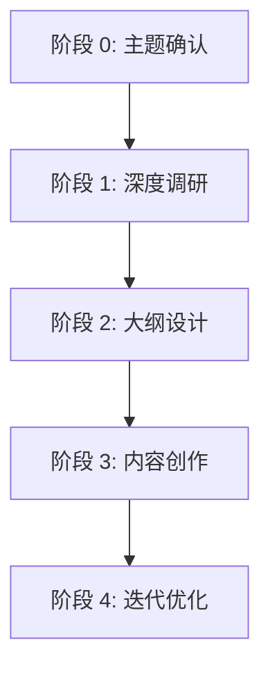

## Overview

这是一个**模块化、渐进式加载**的技术写作 skill。

整个写作流程分为 **4 个阶段**，每个阶段有独立的文档指南：



---

## Workflow

### 阶段 0: 主题确认 📋

**目标**: 明确写作主题、目标读者、核心价值

**详细指南**: 👉 当进入此阶段时，读取 `stage-0-topic.md`

**产出文件**: `wikis/writing/drafts/{article-slug}/00-topic.md`

**下一步**: 用户确认后 → 进入阶段 1

---

### 阶段 1: 深度调研 🔍

**目标**: 通过搜索、阅读、分析，形成对主题的深入理解

**详细指南**: 👉 当进入此阶段时，读取 `stage-1-research.md`

**产出文件**: `wikis/writing/drafts/{article-slug}/01-research.md`

**关键检查**: 👉 参考 `checklists/research-checklist.md`

**下一步**: 用户确认调研充分 → 进入阶段 2

---

### 阶段 2: 大纲设计 📝

**目标**: 设计文章结构，明确每个章节的内容和目标

**详细指南**: 👉 当进入此阶段时，读取 `stage-2-outline.md`

**产出文件**: `wikis/writing/drafts/{article-slug}/02-outline.md`

**关键检查**: 👉 参考 `checklists/outline-checklist.md`

**下一步**: 用户确认大纲合理 → 进入阶段 3

---

### 阶段 3: 内容创作 ✍️

**目标**: 根据大纲创作完整文章

**详细指南**: 👉 当进入此阶段时，读取 `stage-3-writing.md`

**产出文件**: `wikis/writing/drafts/{article-slug}/03-draft-v1.md`

**关键检查**: 👉 参考 `checklists/writing-checklist.md`

**下一步**: 用户反馈 → 进入阶段 4

---

### 阶段 4: 迭代优化 🔄

**目标**: 根据反馈持续优化，直到满意

**详细指南**: 👉 当进入此阶段时，读取 `stage-4-iteration.md`

**产出文件**:
- `03-draft-v2.md`, `03-draft-v3.md` ...
- `03-draft-final.md`

**下一步**: 用户满意 → 发布到 `wikis/writing/published/`

---

## Quick Start

### 用户发起写作请求

当用户说：**"我想写一篇关于 XXX 的文章"**

**立即执行**:

1. **读取主题确认指南**:
   ```
   Read: .claude/skills/technical-writing-skill/stage-0-topic.md
   ```

2. **按指南与用户对话**，确认：
   - 文章主题
   - 目标读者
   - 文章类型
   - 预期长度

3. **创建工作目录**:
   ```bash
   wikis/writing/drafts/{article-slug}/
   ```

4. **使用模板生成 `00-topic.md`**:
   ```
   Read: templates/00-topic-template.md
   填充后 Write 到工作目录
   ```

5. **征求用户确认**，获得确认后 → 进入阶段 1

---

## Progressive Loading Strategy

### 🔑 核心原则

**只在需要时加载对应阶段的文档**，避免一次性加载所有内容。

### 📚 加载时机

| 阶段 | 触发条件 | 需要加载的文档 |
| --- | --- | --- |
| 阶段 0 | 用户发起写作请求 | `stage-0-topic.md` + `templates/00-topic-template.md` |
| 阶段 1 | 用户确认主题 | `stage-1-research.md` + `templates/01-research-template.md` + `checklists/research-checklist.md` |
| 阶段 2 | 用户确认调研充分 | `stage-2-outline.md` + `templates/02-outline-template.md` + `checklists/outline-checklist.md` + `wikis/writing/technical-writing-guide.md` |
| 阶段 3 | 用户确认大纲 | `stage-3-writing.md` + `checklists/writing-checklist.md` + `wikis/writing/technical-writing-guide.md` |
| 阶段 4 | 用户提供反馈 | `stage-4-iteration.md` + `templates/version-changelog-template.md` |

### 💡 上下文优化技巧

1. **阅后即弃**: 读取指南文档后，提取关键步骤，不需要完整保留在上下文中
2. **模板复用**: 模板文件读取后直接填充使用，不保留原始模板
3. **检查清单**: 在完成某阶段后读取，用于自查，完成后可以丢弃

---

## File Structure

```
.claude/skills/technical-writing-skill/
├── SKILL.md                           # 本文件：主入口，流程概览
├── stage-0-topic.md                   # 阶段 0 详细指南
├── stage-1-research.md                # 阶段 1 详细指南（含工具使用）
├── stage-2-outline.md                 # 阶段 2 详细指南（含结构模板）
├── stage-3-writing.md                 # 阶段 3 详细指南（含写作规范）
├── stage-4-iteration.md               # 阶段 4 详细指南（含版本管理）
├── templates/
│   ├── 00-topic-template.md          # 主题确认模板
│   ├── 01-research-template.md       # 调研报告模板
│   ├── 02-outline-template.md        # 文章大纲模板
│   └── version-changelog-template.md # 版本变更说明模板
└── checklists/
    ├── research-checklist.md          # 调研质量检查清单
    ├── outline-checklist.md           # 大纲设计检查清单
    └── writing-checklist.md           # 写作质量检查清单
```

---

## Global References

以下文件在**多个阶段**都会用到，可根据需要加载：

- **写作风格指南**: `wikis/writing/technical-writing-guide.md`
  - 阶段 2（大纲设计）需要
  - 阶段 3（内容创作）需要

- **已发布文章**: `wikis/writing/published/`
  - 可作为风格参考
  - 可作为系列文章索引来源

---

## State Management

### 当前状态跟踪

在执行过程中，维护以下状态信息（轻量级）：

```markdown
**当前项目**: {article-slug}
**当前阶段**: 0/1/2/3/4
**工作目录**: wikis/writing/drafts/{article-slug}/
**已完成文件**: [列表]
**待确认事项**: [列表]
```

### 阶段切换

每次切换阶段时：

1. ✅ 总结当前阶段成果
2. 📋 征求用户确认
3. 🗑️ 清理不再需要的上下文
4. 📚 加载下一阶段的指南文档

---

## Example Flow

### 完整流程示例

**用户**: "我想写一篇关于 LangGraph 1.0 的实战教程"

**AI**:
```markdown
好的，昕哥！我来帮你创作这篇文章。

[读取 stage-0-topic.md]

让我先确认几个问题：
1. 目标读者是？（初学者/进阶）
2. 重点介绍哪些新特性？
3. 想做什么样的 Demo？
...

[创建工作目录 wikis/writing/drafts/langgraph-1.0-tutorial/]
[读取并填充 templates/00-topic-template.md]
[写入 00-topic.md]

请查看 00-topic.md，确认无误后我开始深度调研。
```

**用户**: "确认"

**AI**:
```markdown
收到！进入阶段 1：深度调研

[读取 stage-1-research.md]
[读取 checklists/research-checklist.md]

我将搜索：
✅ LangGraph 1.0 官方文档
✅ GitHub changelog 和 examples
✅ 社区博客
...

[执行调研...]
[读取 templates/01-research-template.md]
[填充并写入 01-research.md]

调研完成！共发现 8 个关键点。
请查看 01-research.md 的 Key Findings 部分。

调研是否充分？
```

**用户**: "充分，继续"

**AI**:
```markdown
收到！进入阶段 2：大纲设计

[读取 stage-2-outline.md]
[读取 wikis/writing/technical-writing-guide.md]
[读取 checklists/outline-checklist.md]

[设计大纲...]
[读取 templates/02-outline-template.md]
[填充并写入 02-outline.md]

大纲已完成！共 8 个章节，预计 8500 字。
请查看 02-outline.md。

结构是否合理？
```

... 以此类推

---

## Benefits of Modular Design

### ✅ 优点

1. **上下文高效**: 只加载当前需要的内容
2. **易于维护**: 每个阶段独立，修改不影响其他部分
3. **灵活扩展**: 可以轻松添加新阶段或子模块
4. **版本控制**: 每个文档独立，便于 Git 管理

### 📊 上下文节省估算

假设完整 SKILL.md 为 **10,000 tokens**：

- **传统单文件**: 每次加载 10,000 tokens
- **模块化加载**:
  - 主文件: 2,000 tokens
  - 每个阶段: 1,500-2,000 tokens
  - 平均每次: **3,500-4,000 tokens**
  - **节省 60%+** 🎉

---

## Version History

- **v1.0** (2026-02-14): Modular progressive disclosure design

---

## Next Steps

开始创作时，请说：

> "我想写一篇关于 [主题] 的文章"

我将引导你完成整个流程！
