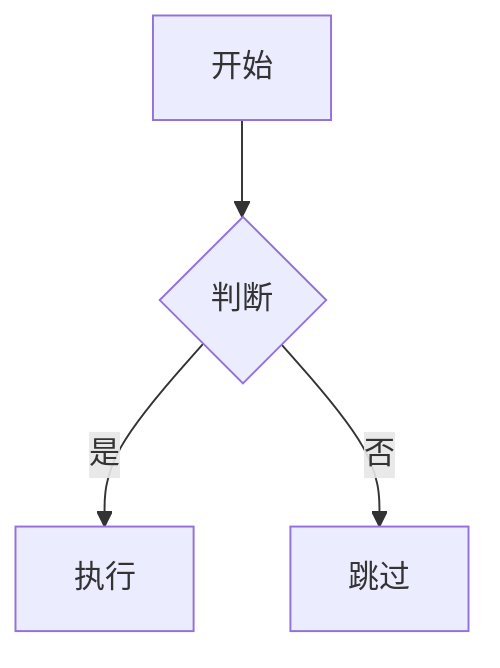
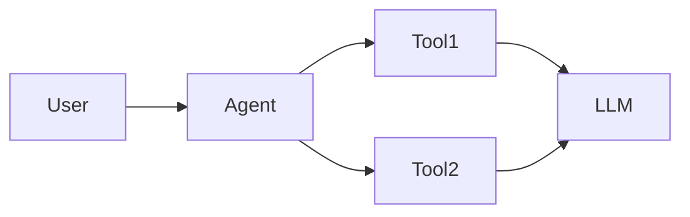
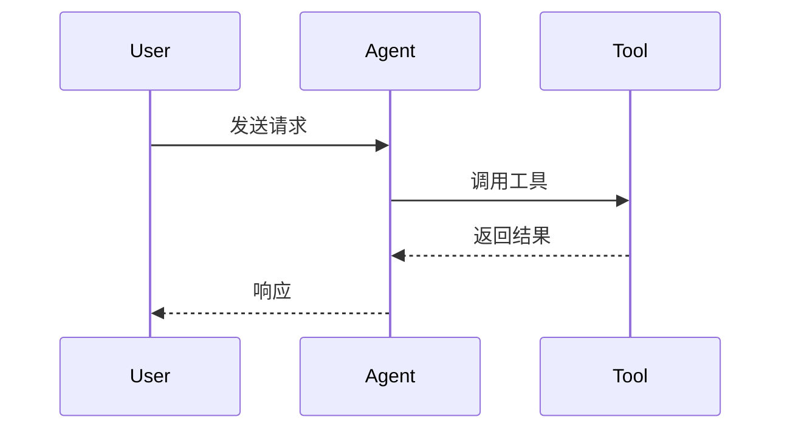

# 阶段 3: 内容创作 ✍️

## 目标

根据大纲创作完整文章，确保内容质量、代码可运行、风格一致。

---

## 执行步骤

### 1. 读取必要的参考文档

#### 大纲文件

```
Read: wikis/writing/drafts/{article-slug}/02-outline.md
```

**提取关键信息**:
- 每个章节的目标和核心内容
- 代码示例规划
- 图表规划
- 预计字数

#### 调研报告

```
Read: wikis/writing/drafts/{article-slug}/01-research.md
```

**重点关注**:
- Key Findings（关键发现）
- 代码示例收集
- 信息来源链接

#### 写作风格指南

```
Read: wikis/writing/technical-writing-guide.md
```

**重点关注**:
- 语言风格（中文标点、英文术语）
- 代码示例规范
- Mermaid 图表使用
- Meta Prompt 方法论

---

### 2. 创作文章

#### 写作顺序建议

**推荐顺序**（不是必须严格遵守）:

1. **YAML Frontmatter** → 元数据
2. **Introduction** → 引入读者
3. **Demo 演示** → 展示效果
4. **Overview** → 建立背景
5. **核心技术章节** → 逐个完成（3-5 个章节）
6. **Advanced Topics** → 进阶内容
7. **Conclusion** → 总结
8. **Call-to-Action** → 社区互动

**为什么这个顺序**:
- Introduction 和 Demo 确立文章基调
- Overview 为后续技术章节打基础
- 核心技术章节是重点，逐个攻克
- Advanced 和 Conclusion 收尾

#### 写作要点

##### Introduction（引言）

**目标**: 吸引读者，建立共鸣

**写作技巧**:
1. **个人经历/痛点引入**（100-200 字）
   ```markdown
   最近在做 XXX 项目时，遇到了 XXX 问题...
   笔者在实践中发现...
   ```

2. **为什么要写这篇文章**（100-150 字）
   ```markdown
   虽然官方文档已经很详细，但笔者发现...
   社区中关于 XXX 的教程大多停留在表面...
   ```

3. **读者能学到什么**（100-150 字）
   ```markdown
   读完本文，你将掌握：
   - XXX 核心概念
   - XXX 实战技巧
   - XXX 最佳实践
   ```

4. **文章结构预告**（50-100 字）
   ```markdown
   本文将从 XXX 出发，逐步深入到 XXX...
   ```

**字数**: 500-800 字

---

##### Demo 演示

**目标**: 展示最终效果，激发兴趣

**写作技巧**:
1. **视觉化展示**
   - 使用截图/GIF/视频
   - 突出核心功能

2. **简洁说明**
   ```markdown
   我们将构建一个 XXX 系统，它可以：
   - 功能 1
   - 功能 2
   - 功能 3

   技术栈：TypeScript + LangGraph + Next.js
   ```

3. **提供链接**
   ```markdown
   完整代码：https://github.com/xxx/xxx
   在线 Demo：https://xxx.vercel.app
   ```

**字数**: 300-500 字

---

##### Overview（概览）

**目标**: 为读者建立技术背景

**写作技巧**:
1. **TL;DR（一句话总结）**
   ```markdown
   **TL;DR**: LangGraph 是一个用于构建 stateful multi-agent 应用的框架。
   ```

2. **核心概念介绍**（2-3 个）
   ```markdown
   ### 核心概念

   #### StateGraph
   StateGraph 是 LangGraph 的核心抽象...

   #### MessageGraph
   MessageGraph 用于处理消息流...
   ```

3. **技术背景/历史**（简述）
   ```markdown
   LangGraph 1.0 在 2025 年 12 月发布，相比 0.x 版本...
   ```

4. **Mermaid 概念图**
   ```mermaid
   graph TD
       A[User Input] --> B[Agent]
       B --> C[Tool]
       C --> D[Output]
   ```

**字数**: 800-1200 字

---

##### 核心技术章节（3-5 个）

**目标**: 深入讲解核心技术点

**写作技巧**:

1. **开头：问题引入**
   ```markdown
   你可能会问：如何实现多 Agent 协作？
   ```

2. **正文：分步讲解**
   - 使用小标题（###）拆分内容
   - 每个小节 300-500 字
   - 穿插代码示例

3. **代码示例**
   - 每个核心技术章节至少 1-2 个代码示例
   - 代码前有说明，代码后有解释
   ```markdown
   下面是一个简单的例子：

   ```typescript
   const graph = new StateGraph({...})
   ```

   这段代码做了以下几件事：
   1. XXX
   2. XXX
   ```

4. **Mermaid 图表**
   - 流程图：展示执行流程
   - 架构图：展示系统结构
   - 序列图：展示交互过程

5. **表格对比**
   - 对比不同方案
   - 总结参数说明

6. **Callouts（可选）**
   ```markdown
   > **NOTE**: 注意 XXX
   > **TIP**: 建议 XXX
   > **WARNING**: 警告 XXX
   ```

**字数**: 每个章节 1000-1500 字

---

##### Advanced Topics（进阶话题）

**目标**: 帮助读者深入和优化

**写作技巧**:

1. **性能优化**
   ```markdown
   ### 性能优化技巧

   #### 1. 减少 API 调用
   - 使用缓存
   - 批量处理

   优化前：
   ```typescript
   // 代码示例
   ```

   优化后：
   ```typescript
   // 代码示例
   ```
   ```

2. **最佳实践**
   ```markdown
   ### 最佳实践

   根据笔者的实践经验，建议：
   1. XXX
   2. XXX
   3. XXX
   ```

3. **常见坑和解决方案**
   | 问题 | 原因 | 解决方案 |
   |------|------|---------|
   | XXX | XXX | XXX |

**字数**: 800-1200 字

---

##### Conclusion（总结）

**目标**: 回顾要点，展望未来

**写作技巧**:

1. **回顾核心要点**
   ```markdown
   本文介绍了 LangGraph 1.0 的核心特性：
   - StateGraph 和 MessageGraph 的使用
   - 多 Agent 协作机制
   - 实战中的最佳实践
   ```

2. **技术展望**
   ```markdown
   LangGraph 的未来发展方向可能包括...
   ```

3. **系列文章链接**
   ```markdown
   如果你对 Agent 技术感兴趣，可以阅读笔者的系列文章：
   - [30分钟从零做个Code Agent](...)
   - [一文读懂 Spec Coding Agent](...)
   ```

4. **鼓励实践**
   ```markdown
   纸上得来终觉浅，建议大家动手实践...
   ```

**字数**: 300-500 字

---

##### Call-to-Action

**写作技巧**:

```markdown
---

## 加入社区

如果觉得本文对你有帮助，欢迎：

- ⭐ **Star GitHub 项目**: [项目链接]
- 👀 **关注 ByteTech**: 获取更多 Agent 技术文章
- 💬 **加入学习社区**: 9k+ 成员，18 个群，一起交流

**笔者的其他文章**:
- [文章 1]
- [文章 2]

**ByteTech x Agent 工程师养成系列**: [系列链接]
```

**字数**: 100-200 字

---

### 3. 代码示例规范

#### 代码格式

```markdown
```typescript
// 单行注释用中文
/* 多行注释也用中文 */

const example = "code here"
```
```

#### 代码说明

**代码前**:
```markdown
下面是一个简单的例子，展示如何创建 StateGraph：
```

**代码后**:
```markdown
这段代码做了以下几件事：
1. 创建了一个 StateGraph
2. 定义了节点和边
3. 编译并运行
```

#### 代码来源

**在代码块后标注来源**（可选，但推荐）:
```markdown
> 来源: [LangGraph 官方文档](https://...)
```

---

### 4. Mermaid 图表规范

#### 流程图



#### 架构图



#### 序列图



---

### 5. 链接和引用

#### 外部链接

**第一次提到技术术语时加链接**:
```markdown
[LangGraph](https://langchain-ai.github.io/langgraph/) 是一个...
```

**后续提到可以不加链接**（避免过多链接干扰阅读）

#### 内部链接

**引用自己的其他文章**:
```markdown
详见笔者之前的文章：[30分钟从零做个Code Agent](/path/to/article.md)
```

---

### 6. 质量检查

参考检查清单：

```
Read: .claude/skills/technical-writing-skill/checklists/writing-checklist.md
```

**自查要点**:
- [ ] 所有章节都完成了吗？
- [ ] 代码示例可运行吗？
- [ ] Mermaid 图表正确吗？
- [ ] 链接都有效吗？
- [ ] 字数符合预期吗？
- [ ] 风格符合 昕哥 的风格吗？

---

### 7. 保存草稿

```
Write: wikis/writing/drafts/{article-slug}/03-draft-v1.md
```

---

### 8. 向用户展示草稿

**输出格式**:

```markdown
✅ 文章创作完成（第 1 版草稿）！

**文章标题**: {标题}

**实际字数**: {数字} 字

**章节完成情况**:
- ✅ Introduction
- ✅ Demo 演示
- ✅ Overview
- ✅ 核心技术章节 1
- ✅ 核心技术章节 2
- ✅ 核心技术章节 3
- ✅ Advanced Topics
- ✅ Conclusion
- ✅ Call-to-Action

**代码示例**: {数量} 个
**Mermaid 图表**: {数量} 个
**外部链接**: {数量} 个

**草稿文件**: `wikis/writing/drafts/{article-slug}/03-draft-v1.md`

**请查看草稿，反馈以下内容**:
- 内容是否准确？
- 代码示例是否合适？
- 是否需要增删某些章节？
- 风格是否符合预期？

**根据你的反馈，我将进入阶段 4：迭代优化。**
```

---

## 常见问题

### Q: 写作时如何保持风格一致？

A: 参考以下技巧：

1. **语言风格**:
   - 中文标点：，。！？""（）
   - 第一人称：笔者、我们
   - 口语化但专业：怎么样？让我们一起...

2. **结构风格**:
   - 每个章节开头：问题引入或目标说明
   - 每个代码示例：前有说明，后有解释
   - 每个技术点：原理 → 示例 → 应用

3. **内容风格**:
   - 实战导向：不只讲概念，要讲怎么用
   - 深入浅出：复杂概念用类比（如 "USB-C" = MCP）
   - 注重细节：常见坑、最佳实践、性能优化

### Q: 如何确保代码示例可运行？

A: 遵循以下原则：

1. **使用调研中的代码**:
   - 优先使用官方示例（已验证）
   - 社区代码要标注来源和运行状态

2. **提供运行环境说明**:
   ```markdown
   运行环境：
   - Node.js 18+
   - LangGraph 1.0
   - TypeScript 5+
   ```

3. **标注修改点**:
   ```markdown
   注意：需要将 `YOUR_API_KEY` 替换为你的实际 API Key
   ```

### Q: 如果字数超出预期怎么办？

A: 两种策略：

1. **压缩内容**:
   - 删除冗余的说明
   - 合并相似的章节
   - 简化代码示例

2. **拆分文章**:
   - 如果字数超过 12,000，考虑拆成系列文章
   - 本文聚焦核心内容，进阶内容放到下一篇

---

## 写作技巧总结

### 技巧 1: 渐进式复杂度

- 简单示例（Hello World）→ 核心功能示例 → 复杂场景示例

### 技巧 2: 重复强化

- 关键概念在多个章节提到
- 使用不同角度（定义 → 示例 → 应用）

### 技巧 3: 视觉化

- 用 Mermaid 图代替文字描述
- 用表格对比代替段落列举
- 用代码示例代替抽象说明

### 技巧 4: 互动感

- 使用 "你可能会问..."
- 使用 "让我们一起..."
- 使用问题引导思考

---

## 下一步

用户反馈后 → **进入阶段 4**

**需要加载的文档**:
```
Read: .claude/skills/technical-writing-skill/stage-4-iteration.md
```
