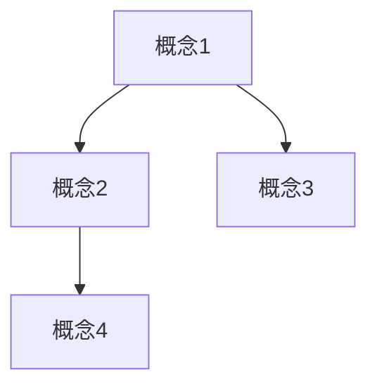

# 调研报告

**文章 Slug**: `{article-slug}`
**调研时间**: {YYYY-MM-DD}

---

## 1. 调研范围

### 官方资源

| 资源类型 | 名称 | URL | 重点内容 |
|---------|------|-----|---------|
| 官方文档 | {文档名} | {链接} | {阅读了哪些章节} |
| GitHub Repo | {仓库名} | {链接} | {查看了哪些文件/示例} |
| Changelog | {版本} | {链接} | {新特性总结} |

### 开源项目

| 项目名 | URL | Stars | 用途 | 关键代码文件 |
|-------|-----|-------|------|-------------|
| {项目1} | {链接} | {数量} | {说明} | {文件路径} |
| {项目2} | {链接} | {数量} | {说明} | {文件路径} |

### 社区内容

| 类型 | 标题 | 作者/来源 | URL | 核心观点 |
|------|------|----------|-----|---------|
| 博客 | {标题} | {作者} | {链接} | {总结} |
| 视频 | {标题} | {频道} | {链接} | {总结} |
| 讨论 | {主题} | {平台} | {链接} | {总结} |

---

## 2. 关键发现（Key Findings）

### 发现 1: {标题}

**说明**: {详细描述这个发现}

**重要性**: {为什么这个发现很重要？}

**来源**:
- {链接 1}
- {链接 2}

**相关代码/截图**: {如有}

---

### 发现 2: {标题}

**说明**: {详细描述这个发现}

**重要性**: {为什么这个发现很重要？}

**来源**:
- {链接 1}
- {链接 2}

**相关代码/截图**: {如有}

---

### 发现 3: {标题}

... _(至少 5-8 个关键发现)_

---

## 3. 核心概念总结

**核心概念列表**:

| 概念 | 定义 | 官方文档链接 |
|------|------|-------------|
| {概念1} | {定义} | {链接} |
| {概念2} | {定义} | {链接} |
| {概念3} | {定义} | {链接} |

**概念关系图**（可选，用 Mermaid）:



---

## 4. 新特性/亮点

**与旧版本对比**（如适用）:

| 旧版本特性 | 新版本特性 | 改进点 |
|-----------|-----------|--------|
| {旧特性} | {新特性} | {说明} |

**与竞品对比**（如适用）:

| 维度 | 本技术 | 竞品A | 竞品B | 优劣分析 |
|------|-------|-------|-------|---------|
| {维度1} | {描述} | {描述} | {描述} | {分析} |

---

## 5. 最佳实践

**官方推荐的使用方式**:

1. **{实践1}**
   - 说明: {详细描述}
   - 来源: {链接}

2. **{实践2}**
   - 说明: {详细描述}
   - 来源: {链接}

**社区经验**:

1. **{经验1}**
   - 来源: {博客/讨论链接}
   - 适用场景: {说明}

---

## 6. 常见坑和解决方案

| 问题 | 表现 | 原因 | 解决方案 | 来源 |
|------|------|------|---------|------|
| {问题1} | {描述} | {原因} | {方案} | {链接} |
| {问题2} | {描述} | {原因} | {方案} | {链接} |

---

## 7. 代码示例收集

### 示例 1: {示例标题}

**来源**: {链接}

**功能**: {说明这个示例做什么}

**代码**:

```typescript
// 粘贴代码
```

**运行状态**: {可直接运行 / 需要修改 XXX}

**笔记**: {有什么值得注意的点}

---

### 示例 2: {示例标题}

... _(至少 3-5 个示例)_

---

## 8. 实际应用案例

**案例 1**: {公司/项目名}

- **使用场景**: {说明}
- **效果**: {成果/数据}
- **来源**: {链接}

**案例 2**: {公司/项目名}

- **使用场景**: {说明}
- **效果**: {成果/数据}
- **来源**: {链接}

---

## 9. 待深入的问题

**在调研中发现但尚未完全理解的问题**:

1. {问题1}
   - 为什么需要深入？
   - 可能的资源：{链接}

2. {问题2}
   - 为什么需要深入？
   - 可能的资源：{链接}

---

## 10. 对文章创作的启发

**结构建议**:
- {基于调研结果，建议文章包含哪些章节}

**重点内容**:
- {哪些内容是读者最关心的，应该重点讲解}

**差异化角度**:
- {与现有教程相比，我们可以从哪些角度切入}

**Demo 设计思路**:
- {基于调研的代码示例，Demo 可以怎么设计}

---

## 11. 调研质量自查

- [ ] 阅读了至少 3 章官方文档
- [ ] 分析了至少 2 个开源项目
- [ ] 阅读了至少 3 篇社区博客
- [ ] 收集了至少 1 个可运行的代码示例
- [ ] 每个关键发现都有来源链接
- [ ] 总结了核心概念和最佳实践
- [ ] 记录了常见坑和解决方案

**调研充分度评估**: {充分 / 基本充分 / 需要补充}

**如需补充，计划补充的内容**: {说明}

---

## 下一步

用户确认调研充分后 → **阶段 2: 大纲设计**
